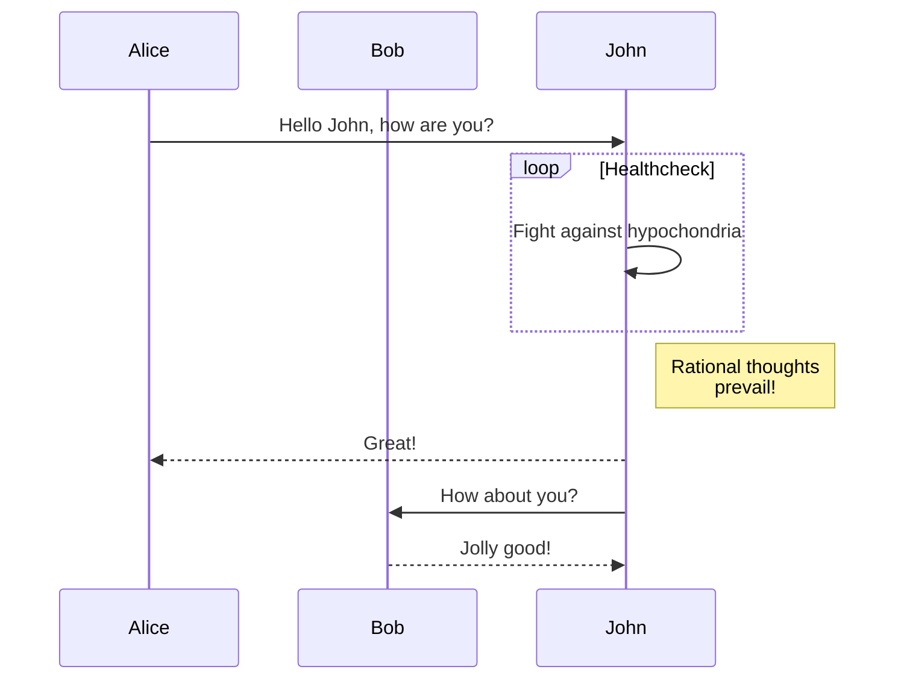

# This is the guide

## Header 2 <!-- {docsify-ignore} -->

Some text

### Header 3

```javascript
const add   = (num1, num2) => num1 + num2;
const total = add(1, 2);

console.log(total); // 3
```

```bash
echo "hello"
```

```php
<?php
function getAdder(int $x): int 
{
    return 123;
}
```

!> **Important** notice with `inline code` and additional placeholder text used
to force the content to wrap and span multiple lines.

?> **Tip** notice with `inline code` and additional placeholder text used to
force the content to wrap and span multiple lines.

## Mermaid



## Tabs

<!-- tabs:start -->

#### **English**

Hello!

#### **French**

Bonjour!

#### **Italian**

Ciao!

<!-- tabs:end -->

## Tables

| Left Align | Center Align | Right Align | Non&#8209;Breaking&nbsp;Header |
| ---------- |:------------:| -----------:| ------------------------------ |
| A1         | A2           | A3          | A4                             |
| B1         | B2           | B3          | B4                             |
| C1         | C2           | C3          | C4                             |

## Emoji

See: [Docsify Emoji](//jhildenbiddle.github.io/docsify-themeable/#/markdown?id=emoji)

**People**

:bowtie:
:smile:
:laughing:
:blush:

## Images

**Inline**


**Reference**

![alt text][logo]

[logo]: //source.unsplash.com/collection/881815 "Provided by unsplash.com"